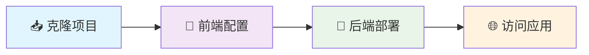
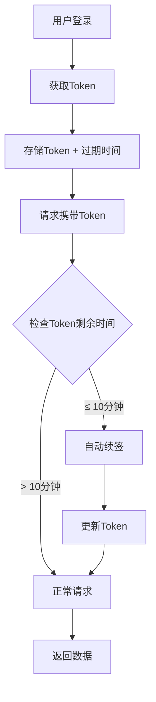

# 🔮 知识棱镜 - 智慧知识管理平台

<div align="center">


**🌟 不只是博客系统，更是你的知识宇宙 🌟**

*AI智能助手 · 资源整合管理 · 知识图谱构建 · 个人品牌打造*

[](https://vuejs.org/)
[](https://www.typescriptlang.org/)
[](https://www.thinkphp.cn/)
[](LICENSE)
[](https://github.com/PumpkinTTL/pure-admin-thin)
[](https://github.com/PumpkinTTL/pure-admin-thin)

--- 

> 💎 **"让知识像光一样，通过棱镜折射出无限可能"**

🚀 **智能写作** | 🔍 **资源整合** | 🧠 **知识图谱** | 👥 **学习社区** | 🤖 **AI助手** | 💎 **VIP会员**

</div>

## 📖 目录

- [✨ 核心功能](#-核心功能)
- [🛠 技术栈](#-技术栈)
- [🚀 快速开始](#-快速开始)
- [📁 项目结构](#-项目结构)
- [🔐 认证机制](#-认证机制)
- [👥 权限管理](#-权限管理)
- [💳 支付系统](#-支付系统)
- [📊 数据可视化](#-数据可视化)
- [🔄 实时通信](#-实时通信)
- [🎨 UI/UX特性](#-uiux特性)
- [📋 API接口](#-api接口)
- [🧪 开发指南](#-开发指南)
- [🤝 贡献指南](#-贡献指南)
- [📄 许可证](#-许可证)

## ✨ 核心功能

### 📝 **智能内容管理**
- **Markdown编辑器** - 所见即所得的编辑体验
- **AI写作助手** - OpenAI集成，智能生成摘要和内容
- **文章状态管理** - 草稿/发布/待审核/下架状态流转
- **版本控制** - 支持文章修改历史追踪
- **批量操作** - 高效的批量编辑和删除

### 🔍 **资源整合系统**
- **智能分类** - 多层级分类体系
- **标签管理** - 灵活的标签系统
- **全文搜索** - 快速定位所需内容
- **收藏管理** - 个人知识库构建
- **资源推荐** - 基于用户行为的智能推荐

### 👥 **社区互动**
- **评论系统** - 支持回复和点赞的评论功能
- **点赞收藏** - 用户互动数据统计
- **用户关注** - 构建学习社交网络
- **消息通知** - 实时推送系统消息
- **学习小组** - 创建和管理学习社群

### 🤖 **AI智能助手**
- **内容生成** - AI辅助写作和摘要生成
- **智能推荐** - 基于用户偏好的个性化推荐
- **问答系统** - AI驱动的智能问答
- **学习分析** - 学习轨迹和进度分析

### 🏆 **成就系统**
- **学习轨迹** - 完整的学习路径记录
- **积分体系** - 多维度积分奖励机制
- **徽章系统** - 成就徽章收集
- **排行榜** - 多维度数据排名
- **个人成长** - 可视化成长报告

## 🛠 技术栈

### 🎯 **前端技术**
```typescript
// 核心框架
Vue 3.4+              // Composition API + 响应式系统
TypeScript 5.0+       // 类型安全 + 开发体验
Vite 5.x              // 极速构建 + HMR热重载

// UI & 样式
Element Plus 3.4+     // 企业级组件库
SCSS + TailwindCSS    // 现代化样式解决方案
Animate.css           // CSS3动画库
Vue Motion            // Vue动画组件

// 状态管理
Pinia                 // 轻量级状态管理
Vue Router 4.x        // 前端路由系统

// 数据可视化
ECharts               // 专业数据可视化
Chart.js              // 轻量级图表库

// 工具库
Axios                 // HTTP请求库
Day.js                // 日期处理
Lodash-es             // 工具函数库
SortableJS            // 拖拽排序

// 增强功能
FontAwesome           // 图标字体库
Socket.IO Client      // 实时双向通讯
OpenAI                // AI智能助手
MD Editor v3          // Markdown编辑器
```

### 🚀 **后端技术**
```php
// 核心框架
ThinkPHP 8.0          // 现代PHP企业框架
PHP 8.0+              // 最新语言特性支持

// 数据存储
MySQL 8.0             // 高性能关系型数据库
Redis 6.0+            // 内存数据库缓存

// 安全认证
JWT Token             // 无状态认证
AES-256 + RSA         // 数据加密算法
自定义Token管理        // 智能续签机制

// 扩展功能
PHPMailer             // 邮件通知服务
OpenAI API            // AI学习助手
Socket.IO Server      // 实时协作服务
Composer              // PHP依赖管理
```

## 🚀 快速开始

### 📋 环境要求

| 环境 | 最低版本 | 推荐版本 |
|------|----------|----------|
| Node.js | 18.0.0 | 20.x LTS |
| pnpm | 8.0.0 | 最新版 |
| PHP | 8.0.0 | 8.2+ |
| MySQL | 8.0.0 | 8.0+ |
| Redis | 6.0.0 | 7.0+ |

### ⚡ 一键部署

<div align="center">



</div>

#### **📥 第一步：克隆项目**
```bash
git clone https://github.com/PumpkinTTL/pure-admin-thin.git
cd pure-admin-thin
```

#### **🔧 第二步：前端启动**
```bash
# 🚀 安装依赖（推荐pnpm，速度更快）
pnpm install

# ⚡ 启动开发服务器（支持热重载）
pnpm dev

# 🏗️ 构建生产版本
pnpm build
```

#### **🚀 第三步：后端配置**
```bash
# 📂 进入后端目录
cd src/admin/m-service-server

# 📦 安装PHP依赖
composer install

# ⚙️ 配置环境变量
cp .env.example .env
# 编辑 .env 文件配置数据库连接

# 💾 初始化数据库
php think migrate

# 🚀 启动后端服务
php think run
```

#### **🌐 第四步：访问应用**
```bash
🌐 前端应用: http://localhost:5173
🔧 后端API: http://localhost:8000
👤 默认账号: admin / admin123
🎉 开始你的知识管理之旅！
```

### ⚙️ 配置说明

**前端配置** (`vite.config.ts`)
```typescript
export default defineConfig({
  server: {
    proxy: {
      '/api': {
        target: 'http://localhost:8000',
        changeOrigin: true
      }
    }
  }
})
```

**环境变量** (`.env`)
```env
# 数据库配置
DB_HOST=127.0.0.1
DB_PORT=3306
DB_NAME=knowledge_prism
DB_USER=root
DB_PASS=your_password

# Redis配置
REDIS_HOST=127.0.0.1
REDIS_PORT=6379
REDIS_PASS=your_redis_password

# JWT配置
JWT_SECRET=your_jwt_secret_key
JWT_EXPIRE=7200
```

## 📁 项目结构

```
pure-admin-thin/
├── 📂 src/                          # 前端源码
│   ├── 📂 api/                      # API接口定义
│   │   ├── article.ts              # 文章相关接口
│   │   ├── user.ts                 # 用户管理接口
│   │   ├── auth.ts                 # 认证相关接口
│   │   └── ...
│   ├── 📂 assets/                   # 静态资源
│   │   ├── images/                 # 图片资源
│   │   ├── icons/                  # 图标文件
│   │   └── fonts/                  # 字体文件
│   ├── 📂 components/               # 公共组件
│   │   ├── dashboard/             # 仪表盘组件
│   │   ├── entertainment/         # 娱乐功能组件
│   │   ├── vips/                  # VIP会员组件
│   │   └── ReAuth/                # 权限组件
│   ├── 📂 hooks/                   # Vue3 Hooks
│   │   ├── useWindowSize.ts       # 窗口大小监听
│   │   └── ...
│   ├── 📂 layout/                  # 布局组件
│   │   ├── components/            # 布局子组件
│   │   ├── theme/                 # 主题配置
│   │   └── types.ts               # 类型定义
│   ├── 📂 router/                  # 路由配置
│   │   ├── modules/               # 路由模块
│   │   └── utils.ts               # 路由工具
│   ├── 📂 store/                   # Pinia状态管理
│   │   ├── modules/               # 状态模块
│   │   └── types.ts               # 状态类型
│   ├── 📂 style/                   # 全局样式
│   │   ├── dark.scss              # 暗黑主题
│   │   ├── element-plus.scss      # Element Plus样式
│   │   └── tailwind.css           # Tailwind样式
│   ├── 📂 utils/                   # 工具函数
│   │   ├── auth.ts                # 认证工具
│   │   ├── tokenManager.ts        # Token管理器
│   │   ├── http/                  # HTTP请求封装
│   │   └── message.ts             # 消息提示
│   ├── 📂 views/                   # 页面组件
│   │   ├── basic/                 # 基础功能页面
│   │   ├── login/                 # 登录页面
│   │   ├── payment/               # 支付相关页面
│   │   ├── permission/            # 权限管理页面
│   │   ├── system/                # 系统管理页面
│   │   └── welcome/               # 欢迎页面
│   └── 📂 admin/                   # 后端项目
│       └── 📂 m-service-server/    # ThinkPHP后端
│           ├── 📂 app/api/         # API应用
│           │   ├── 📂 controller/  # 控制器
│           │   ├── 📂 middleware/  # 中间件
│           │   ├── 📂 model/       # 数据模型
│           │   └── 📂 services/    # 业务服务
│           ├── 📂 config/         # 配置文件
│           ├── 📂 extend/utils/   # 扩展工具类
│           └── 📂 public/         # 入口文件
├── 📂 docs/                        # 项目文档
├── 📂 mock/                        # Mock数据
├── 📂 public/                      # 公共静态文件
├── 📄 package.json                 # 前端依赖配置
├── 📄 vite.config.ts              # Vite配置
├── 📄 tsconfig.json               # TypeScript配置
└── 📄 README.md                   # 项目说明
```

## 🔐 认证机制

### 🛡️ **单Token + 智能续签**
项目采用先进的单Token认证机制，配合智能续签实现无感刷新：

#### **核心特性**
- **Token有效期**: 2小时
- **自动续签**: 剩余10分钟时自动续签
- **并发保护**: 防止多个请求同时触发续签
- **重试机制**: 续签失败时自动重试（最多2次）
- **多标签页支持**: 通过Cookie共享实现多标签页同步

#### **工作流程**


#### **核心文件**
- `src/utils/auth.ts` - Token管理核心工具
- `src/utils/tokenManager.ts` - Token自动续签管理器
- `src/utils/http/index.ts` - HTTP拦截器，集成Token验证

## 👥 权限管理

### 🎭 **RBAC权限模型**
基于角色的访问控制(RBAC)模型，提供细粒度权限管理：

```
用户 (Users) 
    ↓ 多对多
角色 (Roles) 
    ↓ 多对多
权限 (Permissions)
    ↓ 关联
菜单 (Menus)
```

#### **权限控制示例**
```typescript
// 页面权限控制
import { hasPerms } from "@/utils/auth";

// 检查按钮权限
if (hasPerms("user:create")) {
  // 显示创建用户按钮
}

// 检查多个权限
if (hasPerms(["user:update", "user:delete"])) {
  // 显示编辑操作
}

// 组件内权限控制
<Auth value="article:delete">
  <el-button>删除文章</el-button>
</Auth>
```

#### **权限类型**
- **页面权限** - 控制页面访问
- **操作权限** - 控制按钮显示
- **数据权限** - 控制数据访问范围
- **API权限** - 控制接口调用

## 💳 支付系统

### 💰 **多支付方式支持**
集成了丰富的支付方式，满足不同用户需求：

#### **传统支付**
- 🟠 **支付宝** - 扫码支付、APP支付
- 🟢 **微信支付** - 扫码支付、小程序支付
- 🔵 **银联支付** - 网银支付、快捷支付
- 🔵 **PayPal** - 国际支付支持

#### **加密货币**
- 🟡 **Bitcoin (BTC)** - 比特币支付
- 🔷 **Ethereum (ETH)** - 以太坊支付
- 🟢 **USDT (TRC20/ERC20)** - 稳定币支付

#### **支付功能**
- 支付方式管理
- 支付订单跟踪
- 支付状态实时更新
- 多货币支持
- 退款处理
- 支付记录查询

## 📊 数据可视化

### 📈 **仪表盘功能**
提供丰富的数据可视化组件：

#### **核心组件**
- **数据概览卡片** - 关键指标展示
- **销售图表** - 趋势分析
- **排行榜** - 数据排名
- **实时数据** - 动态更新

#### **图表类型**
```typescript
// 支持的图表类型
- 折线图 (Line Chart)      // 趋势分析
- 柱状图 (Bar Chart)       // 数据对比
- 饼图 (Pie Chart)         // 占比分析
- 散点图 (Scatter Chart)   // 相关性分析
- 仪表盘 (Gauge Chart)     // 指标展示
- 热力图 (Heat Map)        // 密度分析
- 地图 (Map Chart)         // 地理数据
```

## 🔄 实时通信

### 💬 **Socket.IO集成**
基于Socket.IO的实时双向通信：

#### **功能特性**
- 实时消息推送
- 在线用户状态
- 系统通知
- 聊天功能
- 协作编辑

#### **使用示例**
```typescript
// 客户端连接
import { socket } from '@/socketio'

// 监听消息
socket.on('message', (data) => {
  console.log('收到消息:', data)
})

// 发送消息
socket.emit('message', {
  type: 'chat',
  content: 'Hello World'
})
```

## 🎨 UI/UX特性

### 📱 **响应式设计**
完美适配各种设备和屏幕尺寸：

#### **栅格系统**
- 基于Element Plus的24栅格系统
- 响应式断点：xs/sm/md/lg/xl
- 灵活的布局组合

#### **移动端优化**
- 触摸友好的交互体验
- 手势操作支持
- 移动端专属组件
- 性能优化

### 🌙 **主题系统**
多主题支持，满足不同用户偏好：

#### **主题类型**
- **亮色主题** - 清新明亮的界面风格
- **暗黑主题** - 护眼的深色主题
- **自定义主题** - 支持主题色自定义

#### **主题切换**
```typescript
// 主题切换示例
import { useThemeStore } from '@/store/modules/theme'

const themeStore = useThemeStore()

// 切换暗黑模式
themeStore.toggleDark()

// 设置主题色
themeStore.setThemeColor('#409EFF')
```

### ✨ **动画效果**
丰富的动画效果提升用户体验：

#### **页面过渡**
- 路由切换动画
- 页面加载动画
- 组件进入/离开动画

#### **交互动画**
- 按钮点击反馈
- 表单验证动画
- 数据加载动画
- 悬停效果

## 📋 API接口

### 🔌 **核心接口**

#### **认证接口**
```http
POST /api/v1/user/login          # 用户登录
POST /api/v1/auth/refresh        # Token续签
POST /api/v1/user/logout         # 用户登出
GET  /api/v1/user/info           # 获取用户信息
```

#### **文章管理**
```http
GET  /api/v1/article/selectArticleAll    # 获取文章列表
POST /api/v1/article/add                 # 添加文章
PUT  /api/v1/article/update              # 更新文章
DELETE /api/v1/article/delete            # 删除文章
POST /api/v1/article/restore             # 恢复文章
```

#### **用户管理**
```http
GET  /api/v1/user/selectUserListWithRoles  # 获取用户列表
POST /api/v1/user/add                       # 添加用户
PUT  /api/v1/user/update                    # 更新用户
DELETE /api/v1/user/delete                  # 删除用户
```

#### **权限管理**
```http
GET  /api/v1/permissions/tree     # 获取权限树
POST /api/v1/permissions/add      # 添加权限
PUT  /api/v1/permissions/update   # 更新权限
DELETE /api/v1/permissions/delete # 删除权限
```

### 📊 **响应格式**
```json
{
  "code": 200,
  "msg": "success",
  "data": {
    "list": [...],
    "pagination": {
      "total": 100,
      "current_page": 1,
      "page_size": 10
    }
  }
}
```

## 🧪 开发指南

### 📝 **代码规范**

#### **编码标准**
- **TypeScript**: 使用setup语法糖
- **组件结构**: 模板 → 脚本 → 样式
- **命名规范**: 
  - 前端：驼峰命名 (camelCase)
  - 后端API：下划线命名 (snake_case)
- **样式**: SCSS + 栅格布局

#### **代码示例**
```vue
<template>
  <!-- 模板部分 -->
  <div class="container">
    <h1>{{ title }}</h1>
  </div>
</template>

<script setup lang="ts">
// 脚本部分
import { ref } from 'vue'

const title = ref('Hello World')
</script>

<style lang="scss" scoped>
// 样式部分
.container {
  padding: 20px;
}
</style>
```

### 🛠️ **开发工具**

#### **代码质量**
- **ESLint** - 代码质量检查
- **Prettier** - 代码格式化
- **TypeScript** - 类型检查
- **Stylelint** - 样式检查

#### **构建工具**
- **Vite** - 快速构建工具
- **PostCSS** - CSS后处理器
- **Autoprefixer** - CSS自动兼容

#### **调试工具**
- **Vue DevTools** - Vue组件调试
- **Network** - API请求监控
- **Console** - 日志输出

### 🚀 **性能优化**

#### **前端优化**
- 路由懒加载
- 组件按需引入
- 图片懒加载
- 虚拟滚动
- 防抖节流

#### **后端优化**
- 数据库索引优化
- Redis缓存策略
- API响应压缩
- 连接池管理

## 🤝 贡献指南

### 🔄 **开发流程**

1. **Fork 项目**
   ```bash
   git clone https://github.com/your-username/pure-admin-thin.git
   ```

2. **创建分支**
   ```bash
   git checkout -b feature/AmazingFeature
   ```

3. **提交更改**
   ```bash
   git commit -m 'feat: 添加新功能'
   ```

4. **推送分支**
   ```bash
   git push origin feature/AmazingFeature
   ```

5. **创建PR**
   - 提交Pull Request
   - 等待代码审查
   - 合并到主分支

### 📝 **提交规范**

```
feat: 新功能
fix: 修复Bug
docs: 文档更新
style: 代码格式调整
refactor: 代码重构
test: 测试相关
chore: 构建/工具相关
perf: 性能优化
```

### 🐛 **问题反馈**

- **Bug报告** - 使用Issue模板提交Bug
- **功能建议** - 提出新功能的想法和建议
- **安全问题** - 私信报告安全问题

## 📄 许可证

本项目采用 [MIT License](LICENSE) 开源协议。

```
MIT License

Copyright (c) 2024-present 知识棱镜

Permission is hereby granted, free of charge, to any person obtaining a copy
of this software and associated documentation files (the "Software"), to deal
in the Software without restriction, including without limitation the rights
to use, copy, modify, merge, publish, distribute, sublicense, and/or sell
copies of the Software, and to permit persons to whom the Software is
furnished to do so, subject to the following conditions:

The above copyright notice and this permission notice shall be included in all
copies or substantial portions of the Software.
```

## 🙏 致谢

感谢以下开源项目的支持：

- [Vue.js](https://vuejs.org/) - 渐进式JavaScript框架
- [Element Plus](https://element-plus.org/) - Vue 3 企业级组件库
- [ThinkPHP](https://www.thinkphp.cn/) - 简洁优雅的PHP框架
- [Pure Admin](https://github.com/pure-admin/vue-pure-admin) - 优秀的管理后台模板

---

<div align="center">

**⭐ 如果这个项目对你有帮助，请给个Star支持一下！**

**📧 联系我们: weeksevenss@gmail.com**

**🌐 官方网站: https://lengz.com**

**💬 技术交流: 欢迎提交Issue或PR**

</div>
